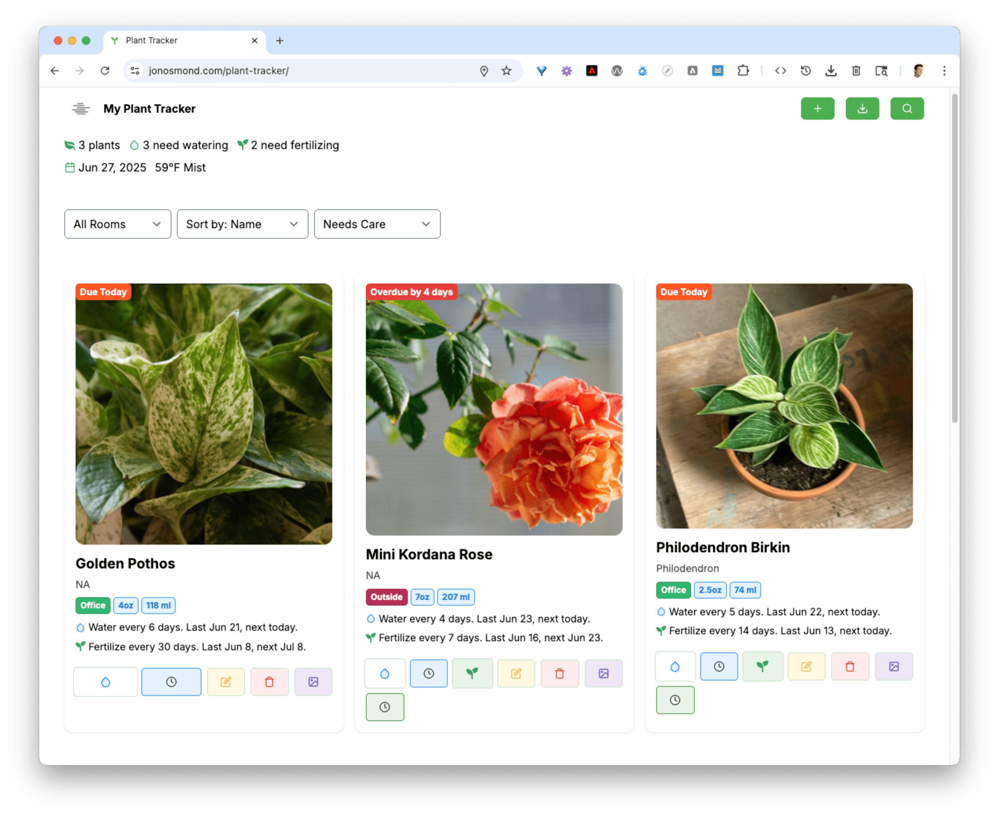

# Plant Tracker

Plant Tracker is a small PHP web app that helps you keep your houseplants healthy. It stores each plant in a MySQL database and lets you tick off watering and fertilizing tasks right in your browser. A couple of tiny calculators use local weather data to estimate how much water your plants need.



*Overview of the main interface listing plants and upcoming tasks.*

## Prerequisites
- [PHP](https://www.php.net/manual/en/install.php)
- [MySQL](https://dev.mysql.com/doc/refman/8.0/en/installing.html)
- [Node.js](https://nodejs.org/en/download/)

## Setup
1. Clone this repository.
2. Copy `config.example.php` to `config.php` and edit the settings, including your OpenWeather API key:

```php
'openweather_key' => 'YOUR_API_KEY',
'location'        => 'City,Country',
'ra'              => 20.0,
'kc'              => 0.8,
'kc_map' => [
    'succulent'  => 0.3,
    'houseplant' => 0.8,
    'vegetable'  => 1.0,
    'flower'     => 0.9,
    'cacti'      => 0.28,
],
'bed_map' => [
    'vegetable' => [
        'kcb' => [
            'ini' => 0.3,
            'mid' => 1.05,
            'end' => 0.95,
        ],
        'kc_soil' => 1.1,
    ],
    'flower' => [
        'kcb' => [
            'ini' => 0.35,
            'mid' => 1.1,
            'end' => 1.0,
        ],
        'kc_soil' => 1.05,
    ],
],
```

   The OpenWeather API key and location are required for the water calculators.
3. Copy `db.example.php` to `db.php` and add your MySQL credentials.
4. Run the database migrations:

```bash
php scripts/run_migrations.php
```

5. Start the PHP development server and open the app:

```bash
php -S localhost:8000
```

   Then visit `http://localhost:8000/index.html` in your browser.
   **Note:** Opening `index.html` directly as a file won't work because the JavaScript needs the PHP API endpoints.

## Deployment
Deploying the app to a server running PHP is straightforward:

1. Copy this repository to your host, either by cloning it with `git` or uploading the files via FTP.
2. On the server, create `config.php` and `db.php` from their respective `*.example.php` templates and adjust the settings.
3. Run `php scripts/run_migrations.php` to initialize the database.
4. Ensure the `uploads/` directory is writable by the web server so image uploads work.

## Project Structure
- `api/` holds the PHP endpoints used by the front end.
- `uploads/` stores images you attach to plants.
- `scripts/` contains helper scripts such as the migration runner.

## Running Tests
PHPUnit exercises the API code. From the project root simply run:

```bash
phpunit
```

It loads a stub database config from `tests/db_stub.php` unless you override `DB_CONFIG`.

The JavaScript helpers use Jest. After installing the Node packages run:

```bash
npm test
```

## Calculators
Two small utilities help estimate watering needs:

- `calculator.php` &mdash; calculates daily water for a single pot using weather data.
- `bed_calculator.php` &mdash; computes irrigation for an entire garden bed.

Both rely on the coefficients defined in `config.php`.

Weather data retrieved from OpenWeather is cached for one hour to limit API requests and speed up page loads. The calculators automatically use the cached response if available.

## Basic Usage
Use the main interface at `index.html` to add plants, mark them as watered or fertilized, and upload photos. The API endpoints under `api/` are used by the front‑end JavaScript (`script.js`) to interact with the database.

In list or text view you can swipe right on a plant card to complete all due tasks (watering and fertilizing) at once. The card slides with your finger and smoothly snaps back if you don't pass the threshold.

You can also export your current plant list as JSON or CSV using the download buttons at the top of the page.

## Service Worker
A small service worker caches the key pages and scripts so the app still opens when you're offline. During development you may need to disable the cache or bump the version in `service-worker.js` to pick up changes.

